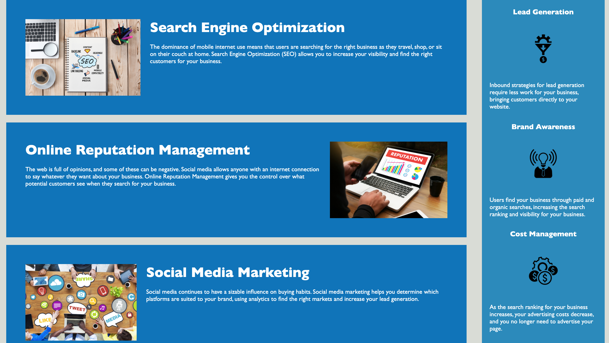

# Horiseon code refactor 1.0

This is the refactor of Horiseon's website to make it more web accessible. Web accessibility is an increasingly important consideration for businesses. It ensures that people with disabilities can access a website using assistive technologies such as video captions, screen readers, and braille keyboards. Making a website accessible is also good for business for many reasons, one of them being that accessible sites are better positioned in search engines like Google. It also helps companies avoid litigation that can occur when people with disabilities cannot access their website.

## Installation

Clients and visitors of the site will access it through:

- The URL of the deployed application.
  https://andrediop.github.io/horiseon-code-refactor/

Pull requests are welcome. For major changes, please open an issue first to discuss what you would like to change.

- The URL of the GitHub repository.
  https://github.com/AndreDiop/horiseon-code-refactor

```bash
pip install foobar
```

## Usage




```

## Credits

This readme was made with templates available from [Make a readme](https://www.makeareadme.com/). Which has tools which can show the power of markdown.

## Contributing

I welcome Pull requests and all constructive criticism. If you would like to make a major change, open an issue first to discuss changes.

## License

[MIT](https://choosealicense.com/licenses/mit/)
